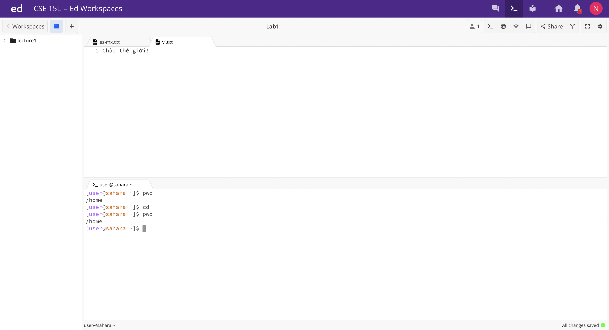

# Lab 1 Report

## cd command

- No arguments:
  - Output: 
    
  - Working Directory: /home
    
  - Output Reasoning: I didn't get an output, instead I was pushed to the home directory. I would assume cd takes you to the home directory anyway. 
    
  - Error? It is not an error because it is our home directory. 
    
- Directory argument:
  - Output:
    
  - Working Directory: I was in the home directory before entering the command "cd lecture1". After that ran, I entered the lecture1 directory. 
    
  - Output Reasoning: Because I was in the home directory, the only directory within it was lecture1. As soon as I ran "cd lecture1", it entered it. 
    
  - Error? It is not an error because it entered the directory I called for. 
    
- File argument:
  - Output: 
    
  - Working Directory: I was in the lecture1 directory before entering the command "cd Hello.java". I stayed in the lecture1 directory after it ran. 
    
  - Output Reasoning: I got an error message because cd is used to enter directories, not files. 
    
  - Error? It is definitely an error because cd is used to enter directories, not files. 
  
---

## ls command
- No arguments:
  - Output:
    
  - Working Directory: I was in the home directory before entering the command "ls". After that ran, I stayed in the home directory. 
    
  - Output Reasoning: The command listed the directories and files in the working directory, so I assume no arguments means that it will list whatever is in the working directory.
    
  - Error? It is not an error. 
    
- Directory argument:
  - Output: 
    
  - Working Directory: I was in the home directory before entering the command "ls lecture1". After that ran, I stayed in the home directory. 
    
  - Output Reasoning: Since we called that command, it listed the directories and files in lecture1. 
    
  - Error? It is not an error. 
    
- File argument:
  - Output: 
    
  - Working Directory: I was in the lecture1 directory before entering the command "ls Hello.java". After that ran, I stayed in the lecture1 directory.
    
  - Output Reasoning: Since we called that command, it listed the files in Hello.java, and actually just outputted the name of the file. 
    
  - Error? I don't think this is an error. 
  
---

## cat command
- No arguments:
  - Output:
    
  - Working Directory: /home
    
  - Output Reasoning: The terminal was waiting for an argument. When I typed "hi" and pressed enter, it just outputted "hi: and waited for more arguments. 
    
  - Error? I don't think this is an error because cat is supposed to read files, so it would make sense that it is waiting for something to read and output. 
    
- Directory argument:
  - Output:
    
  - Working Directory: /home
    
  - Output Reasoning: There was an error message stating that lecture1 is a directory.  
    
  - Error? There was an error message because lecture1 is a directory and the cat command reads through files, not directories. 
    
- File argument:
  - Output:
    
  - Working Directory: /home/lecture1
    
  - Output Reasoning: The terminal outputted everything that was written in the Hello.java file. 
    
  - Error?  There was no error. 
