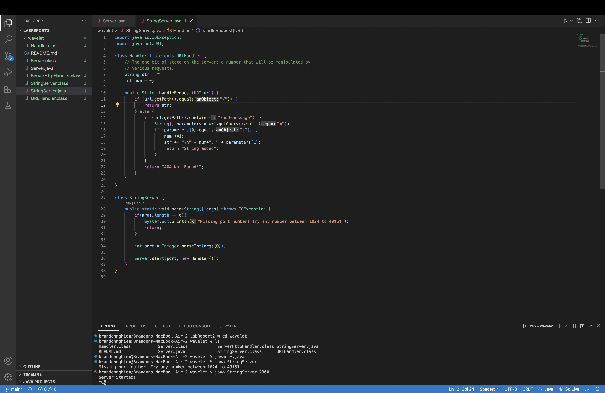
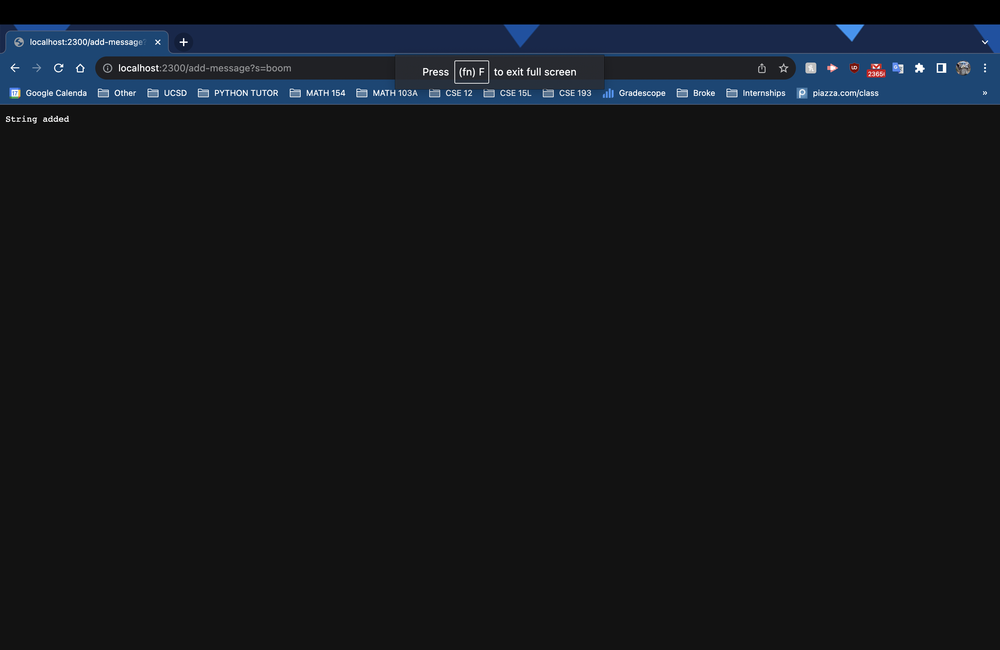
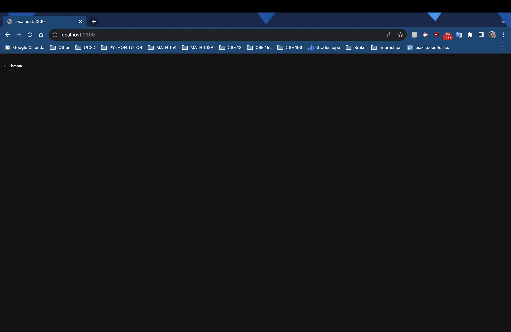
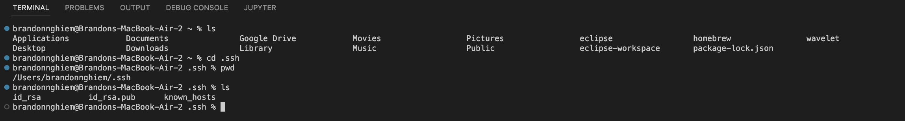
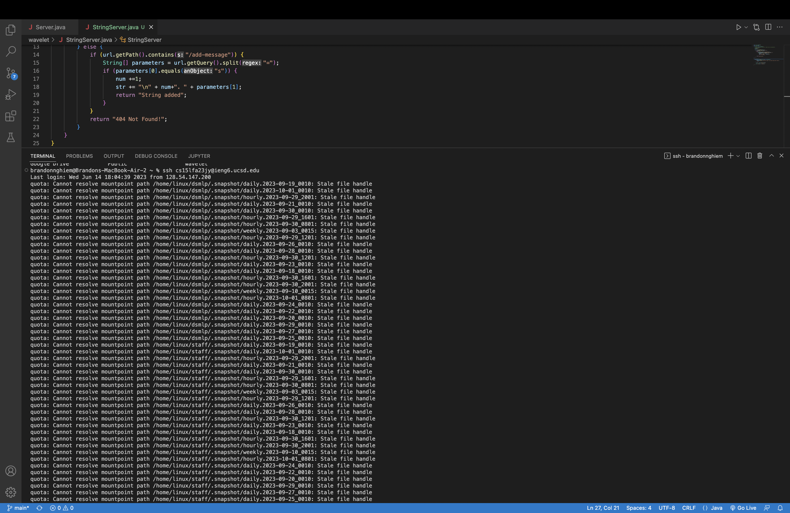

# Lab 2 Report

## Part 1

	
	
	
	

When I started the server, the main method was called to establish the port number, which I chose to be 2300. Then when I added the first word, the handleRequest method was called. It passed in the path from the url.

In the handleRequest method, the argument is the URL because that's where it pulls the path. String str is a data field that represents the string to be printed on the screen. Int num is a data field that both counts how many words have been added and what position the word is at. 

When I added the first word, the num gets incremented to 1 and the string becomes "\n 1. boom". The URL was http://localhost:2300/add-message?s=boom.

	
	

When I started the server, the main method was called to establish the port number, which I chose to be 2300. Then when I added the first word, the handleRequest method was called. It passed in the path from the url.

In the handleRequest method, the argument is the URL because that's where it pulls the path. String str is a data field that represents the string to be printed on the screen. Int num is a data field that both counts how many words have been added and what position the word is at. 

When I added the second word, the num was incremented to 2 and the string became "\n 2. bam". The URL was http://localhost:2300/add-message?s=bam.

---

## Part 2

	

I entered the .ssh directory in order to find the private and public key. The private key is id_rsa while the public key is id_rsa.pub.

	

Here is me logging into ieng6 :)

---

## Part 3

I learned how to access a remote host from my local computer which was really cool. I also learned that the mkdir command makes directory, even if they're new to the file system. 
