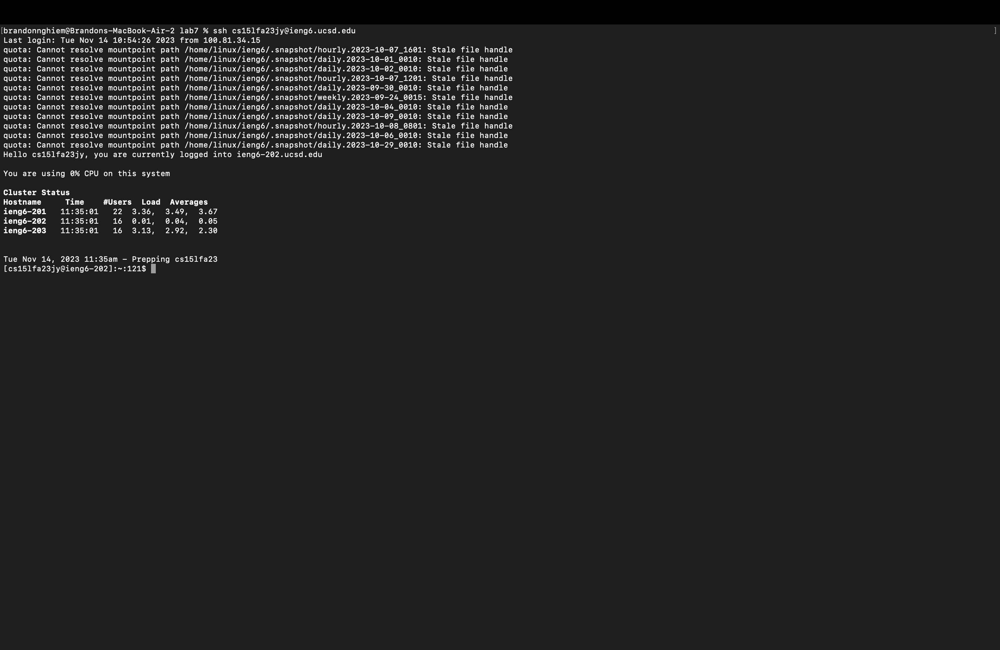
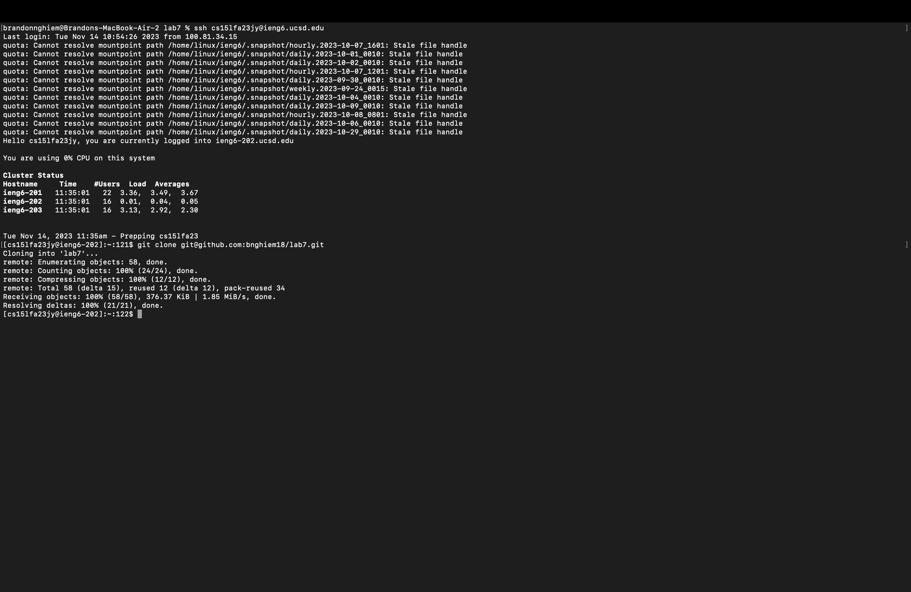
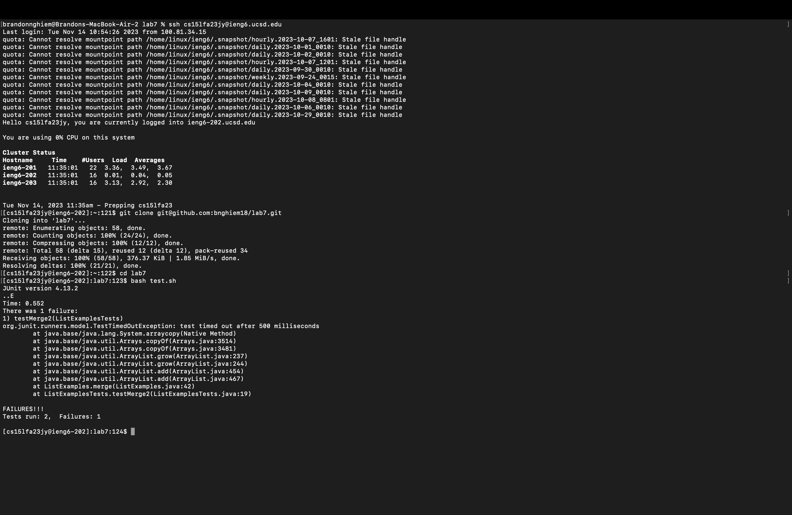
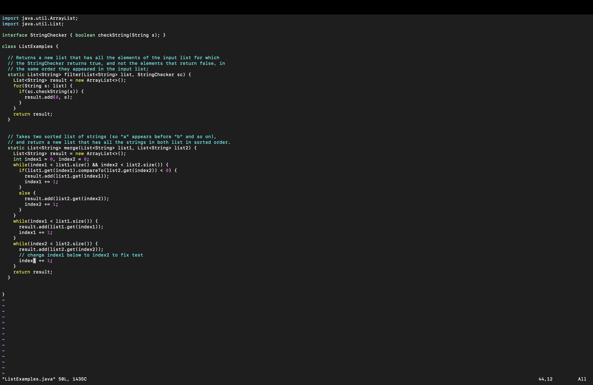
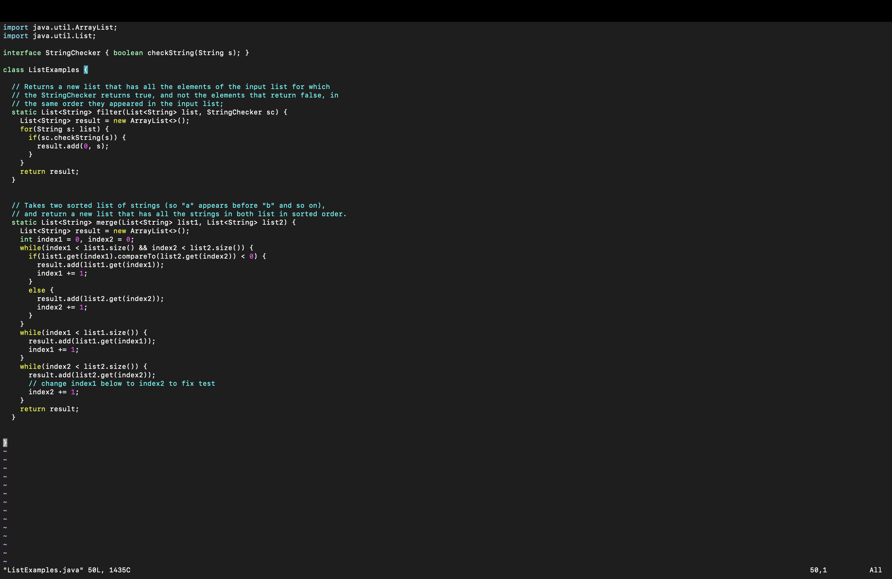
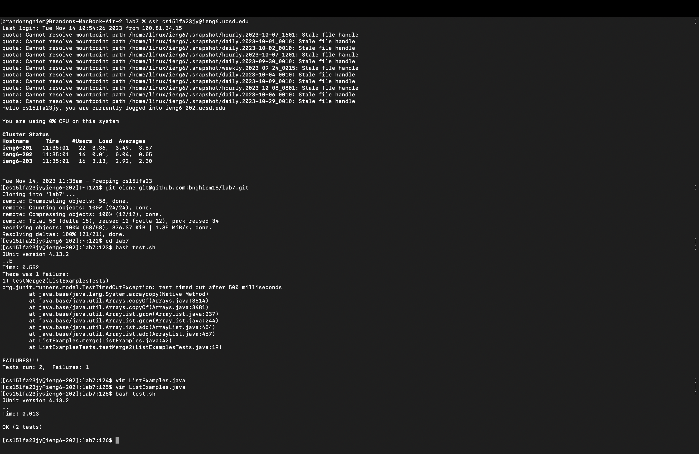
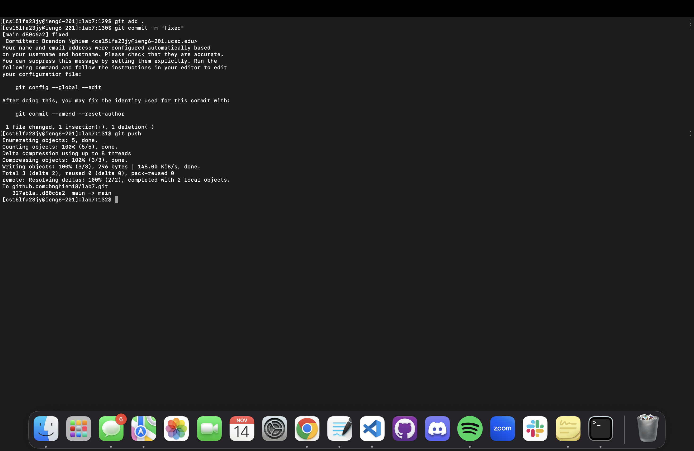

# Lab Report 4

**4) Log into ieng6**

- KEYS PRESSED: `<up>`
- REASONING: I already had the `ssh cs15lfa23jy@ieng6.ucsd.edu` in my most recent history, so I just clicked the up arrow once to access it.

___

**5) Clone your fork of the repository from your Github account (using the SSH URL)**

- KEYS PRESSED: `git clone` `<COMMAND V>` to paste the fork link `<ENTER>`
- REASONING: I typed out git clone and then pasted the fork link and pressed enter in order to clone the fork using the SSH url.

___

**6) Run the tests, demonstrating that they fail**

- KEYS PRESSED: `<c><d><SPACE><l><a><b><7>` `<ENTER>` `<b><a><s><h><SPACE><t><e><s><t><.><s><h>``<ENTER>`
- REASONING: I entered the lab7 directory and then I already knew that there was a test.sh file inside the directory, so I ran bash test.sh to produce the test results. 

___

**7) Edit the code file to fix the failing test**

Before Edit:

After Edit:

- KEYS PRESSED: `<v><i><m><SPACE><L><i><s><t><E><x><a><m>
<l><e><s><.><j><a><v><a>` `<ENTER>` `<x><i><2><ESC>``<:><w><q><ENTER>`
- REASONING: I entered the ListExamples.java file through vim in order to enable text editing. For some reason my cursor was already at 1 in index1, where I needed to apply the edit (I have no idea how this happened). I deleted 1 by pressing x over 1 and then I entered insert mode by clicking i. I pressed 2 to insert 2. Then i exited insert mode by clicking ESC. Then I saved and exited by pressing :wq then Enter. 

___

**8) Run the tests, demonstrating that they now succeed**

- KEYS PRESSED: `<up><up><ENTER>`
- REASONING: I already knew bash test.sh was in my history, so I pressed up twice and then enter to run the tests again. 

___

**9) Commit and push the resulting change to your Github account (you can pick any commit message!)**

- KEYS PRESSED:
    - `<g><i><t> <SPACE> <a><d><d> <SPACE> <.> <ENTER>`
    - `<g><i><t> <SPACE> <c><o><m><m><i><t> <SPACE> <-><m> <SPACE> <"><f><i><x><e><d><"> <ENTER>`
    - `<g><i><t> <SPACE> 
<u><s><h> <ENTER>`

- REASONING: Alon had told me to add all the files from my working directory into the stage, I should do git add with a period dot. This added the changes I made in ListExamples.java to the stage. Then when I ran git commit -m, I made the commit message "fixed". After I added, and committed, I pushed the changes into the repository with git push. 
