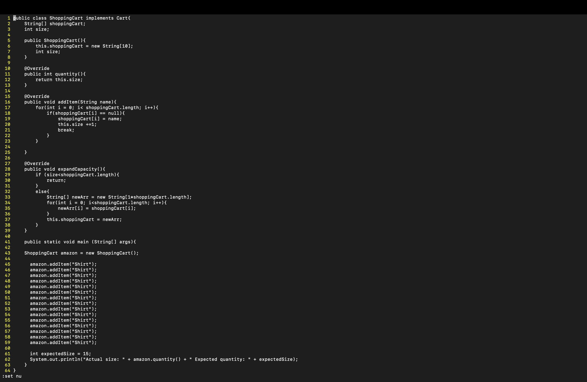
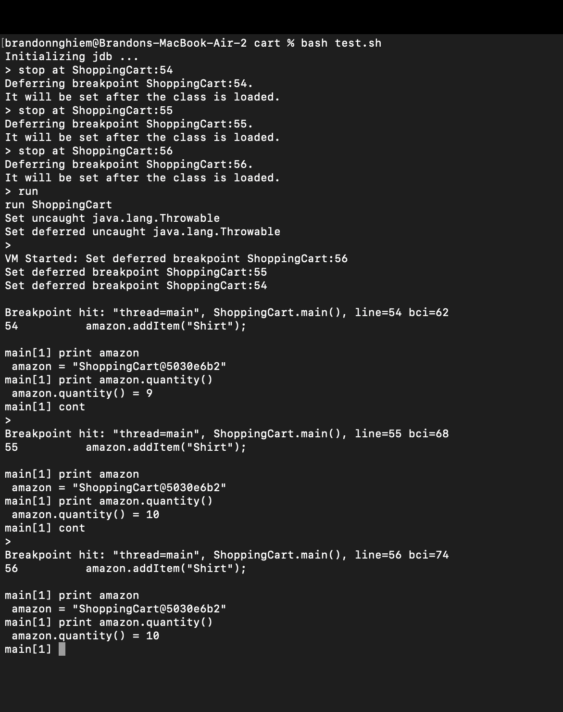
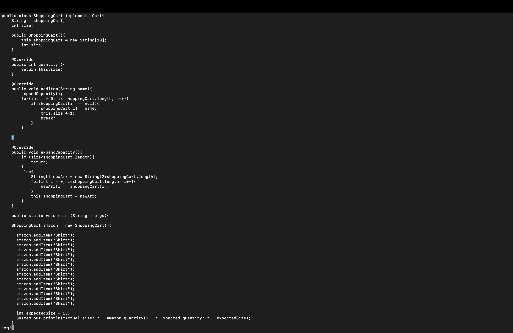
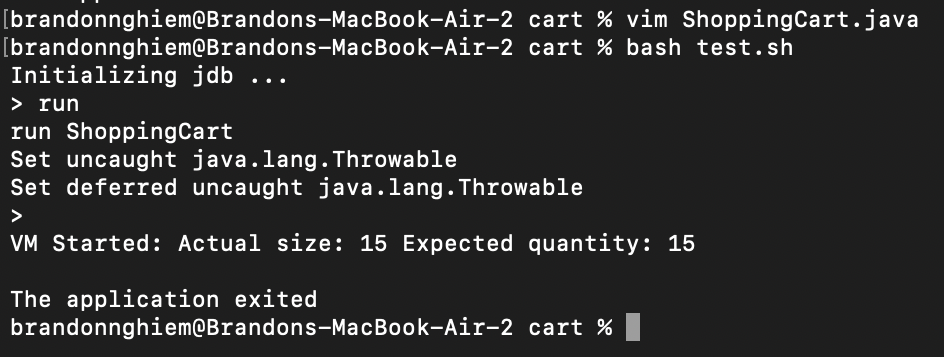

# Lab Report 5
Programming Assignment Directions:

For this PA, the student is designing their own implementation of a shopping Cart. In the starter code, they are given three files: Cart.java, ShoppingCart.java, and test.sh. They are editing this program directly through the terminal using vim and linux commands.

**Cart.java**:
This file is an interface that contains 3 abstract methods:
- int quantity();
  - returns the total amount of items in the cart
- void addItem(String Name);
  -  adds the desired item to the cart, and increases the size by 1
- void expandCapacity();
  - expands the size of the cart if the cart is full

**ShoppingCart.java**:
The student's implementation of Cart.java and whatever data fields they want to add. This file also has a main method where they can test their code instead of JUnit, so that they can use jdb. 


**test.sh**:
Bash script to run tests using JDB


## Original Post: Symptom + Description of Bug 

> Hi, I have implemented the three methods in my ShoppingCart.java file. The file compiles, so my code seems to work. I have ran three tests each testing the quantity of the basket I made. I ran and instance of the test with 1 item, another with 10 items, and a third instance with 15 items. All my tests pass but my cart with 15 items. If I was succesful in adding 1 and 10 items, why does my third test fail? I want to assume that I can't add more than 10 items. I have an expandCapacity method that makes the basket bigger if the size exceeds the length of the array, so the problem must be in my add method?  
 
Here is a screenshot of the symptom:


Here is my ShoppingCart.java Implementation:
```
public class ShoppingCart implements Cart{
    String[] shoppingCart;
    int size;

    public ShoppingCart(){
        this.shoppingCart = new String[10];
        int size; 
    }

    @Override
    public int quantity(){
        return this.size;
    }

    @Override
    public void addItem(String name){
        for(int i = 0; i< shoppingCart.length; i++){
            if(shoppingCart[i] == null){
                shoppingCart[i] = name;
                this.size +=1;
                break;
            }
        }

    }

    @Override
    public void expandCapacity(){
        if (size<shoppingCart.length){
            return;
        }
        else{
            String[] newArr = new String[shoppingCart.length];
            for(int i = 0; i<shoppingCart.length; i++){
                newArr[i] = shoppingCart[i];
            }
            this.shoppingCart = newArr;
        }
    }
}

public static void main (String[] args){

    ShoppingCart amazon = new ShoppingCart();

      amazon.addItem("Shirt");
      amazon.addItem("Shirt");
      amazon.addItem("Shirt");
      amazon.addItem("Shirt");
      amazon.addItem("Shirt");
      amazon.addItem("Shirt");
      amazon.addItem("Shirt");
      amazon.addItem("Shirt");
      amazon.addItem("Shirt");
      amazon.addItem("Shirt");
      amazon.addItem("Shirt");
      amazon.addItem("Shirt");
      amazon.addItem("Shirt");
      amazon.addItem("Shirt");
      amazon.addItem("Shirt");

      int expectedSize = 15;
      System.out.println("Actual size: " + amazon.quantity() + " Expected quantity: " + expectedSize);
    }
```

## TA Response: Guiding Question
> Hello student, you are correct in assuming that the two possible explanations to the wrong output involve either the add method or the expandCapacity method. When we run the bash file to enter the jdb mode, how can we go through your shopping cart incrementally to check at certain quantities? Maybe there is a specific quantity you are able to add up to, and then after that we reached our limit. If that's the case than there could exist a possible bug in the expandCapacity method. Useful commands you could try are `stop` (in JDB) and `cont` (in JDB) to traverse your array. To help find breakpoints in vim, you can enter the command `:set nu` in order to show the line numbers in your file. 


## Putting Advice to Use

Using these commands, the student was able to assess the quality of the add method and the expandCapacity method. Setting up breakpoints for adding the ninth item, the tenth item, and the eleventh item, they discovered that after adding the tenth item, the quantity remained the same. But going from 9 to 10 increased the quantity, so the bug seems to be in the expandCapacity method. After this realization the student wen tback to examine their expandCapacity() method and realized that when they were creating a new array, they were setting the size of the array to be the same length instead of doubling it. They also forgot to make a direct call to the expandCapacity method in the add method, so turns out their bug was in both methods as they assumed. 

Navigating with `:set nu`:


JDB Setting up breakpoints:


Fixing the Bugs:


Success:


Bug: The expandCapacity() method created a new array that had the same size as the origninal array (essentially doing nothing), and the add method did not make a call to the expandCapacity() method. 

## Setup Information:

**Directory structure**: 
- LabReport5Code
  - cart
    - Cart.java
    - ShoppingCart.java
    - test.sh

**Contents of file before bug**:


**Command line info that triggered bug**:
1) Run `bash test.sh`
2) In JDB mode, use command `run`

Description of what to edit to fix the bug:
1) `vim ShoppingCart.java`
2) `:set nu` to find line numbers (for breakpoints)
3) `:q!` to exit vim
4) Run `bash test.sh`
5) `stop at ShoppingCart: 54` et breakpoints in file ShoppingCart.java for lines 54, 55, 56 (or whatever breakpoints that will help you understand the bug) 
6) `cont` to move through breakpoints
7) `exit` to leave JDB
8) `vim ShoppingCart.java`
9) Move to line 33: `String[] newArr = new String[shoppingCart.length]` change to `String[] newArr = new String[2*shoppingCart.length]`
10) Create a new line after line 16 and call the expand capacity method: `expandCapacity();`
11) `esc` to leave insert nmode
12) `:wq!` to save changes
13) Run `bash test.sh`, and expected quantity should match up with actual quantity


